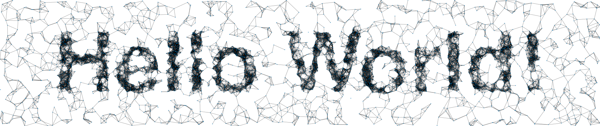

Putting Words in Graphs
=======================

Want to make pictures that look like this?

[Watch me write all of this code on Youtube](https://www.youtube.com/watch?v=1hvz5nT8e9A&feature=youtu.be)

Want it easy-to-use and all-in-one? Use `all-together-for-you.jl` and
`extra-pictures.jl` and `extra-movies.jl`!

Want to understand it? 
Checkout the `working.jl` code!

Want a planar graph? Checkout `working-delauney.jl` code!

